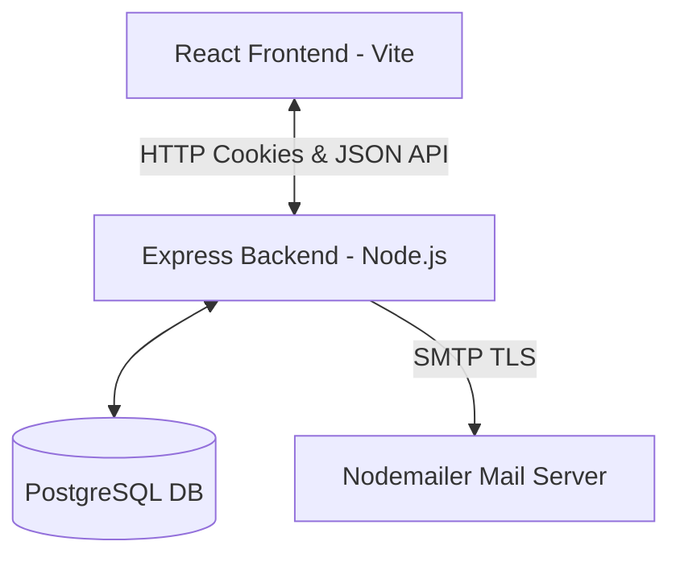
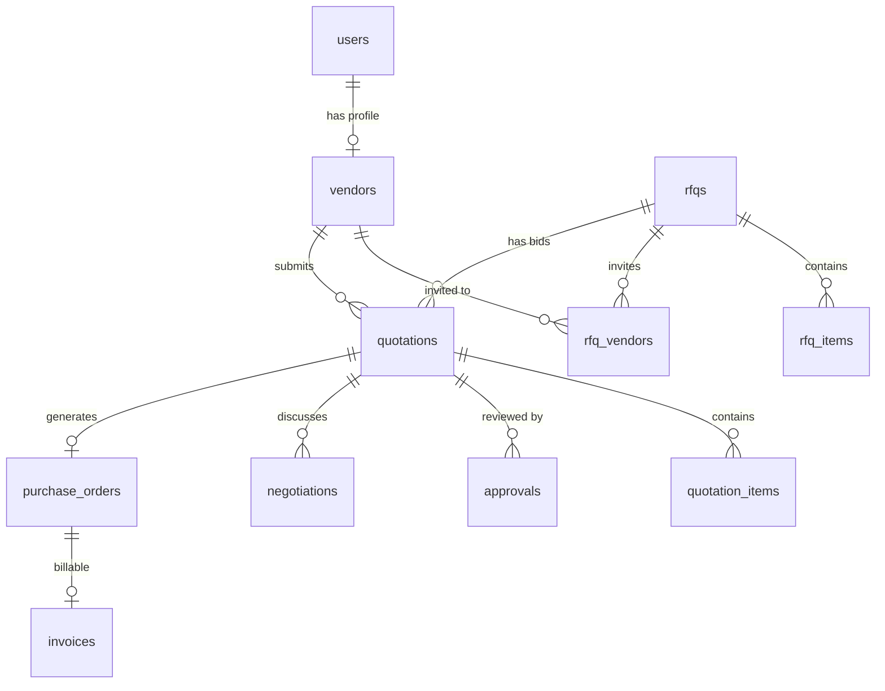

# VendorBridge — Procurement & Vendor Management ERP

VendorBridge is a modern, enterprise-grade Procurement and Vendor Management ERP system designed to simplify, digitize, and automate procurement workflows. This platform bridges the gap between organizations and vendors by centralizing RFQs, quotations, negotiations, approvals, purchase orders, invoices, and audit logging into a single unified system.

---

## 🚀 Vision & Problem Alignment

As detailed in the **VendorBridge Hackathon Problem Statement**, procurement in many organizations suffers from manual inefficiencies, communication gaps, and fragmented tracking. VendorBridge addresses these pain points by offering:
- **Role-Based Procurement Boundaries**: Isolated workspaces for Procurement Officers, Vendors, Managers/Approvers, and Administrators.
- **RFQ Bidding Lifecycle**: Smooth workflow from RFQ publication to vendor invitation, bidding, and quotation comparison.
- **Automated Document Generation**: One-click generation of Purchase Orders and Invoices following quotation approval.
- **Secure Email Alerts**: Real-time nodemailer alerts sending invoices directly to vendors and approved quotes to managers.
- **Client-Side Document Exporting**: Zero-popup, beige-and-rust-orange styled PDF downloads of invoices using `html2pdf.js`.

---

## 🛠 Tech Stack & Architecture

VendorBridge is built using a decoupled client-server architecture:



### Frontend (`/Frontend`)
- **Core Framework**: React 19 (Vite bundler) for high performance and fast hot module replacement.
- **Routing**: React Router 7 supporting `ProtectedRoute` (requires verified JWT session) and `PublicOnlyRoute` (e.g. login/register pages).
- **Styling**: Modern, premium CSS and SCSS styles utilizing custom neumorphic soft-shadow themes, smooth transition animations, and fixed-height scroll boundaries.
- **Exports & Printing**: `html2pdf.js` library for off-screen rendering of letter-sized documents, ensuring downloads match the rust-orange title highlights and beige (`#FAF6F0`) backgrounds.

### Backend (`/Backend`)
- **Server Engine**: Node.js with Express framework.
- **Database Engine**: PostgreSQL connected via pg pool clients supporting secure SQL transaction blocks.
- **Security & Session**: Cookie-based JWT authentication (`jwt-access-token`) with cryptographically signed tokens.
- **Automated Notifications**: Nodemailer-driven SMTP mail delivery, sending PDF-like HTML email templates for invoice generation and quotation approvals.

---

## 🗄 Database Schema

The database model handles structured relationships between core procurement objects:



### Tables Catalog
1. **`users`**: Authentication credentials, roles (`ADMIN`, `MANAGER`, `VENDOR`, `PROCUREMENT`), and approval status.
2. **`vendors`**: Profile details for registered vendors (company name, GSTIN, rating, phone, address).
3. **`rfqs`**: Request for Quotations (title, description, status `DRAFT`/`OPEN`/`CLOSED`, deadline).
4. **`rfq_items`**: Quantities and unit specs requested under an RFQ.
5. **`rfq_vendors`**: Multi-to-multi mapping of invited vendors to RFQs.
6. **`quotations`**: Bid documents submitted by vendors (total bidded price, delivery timeline, notes, status).
7. **`quotation_items`**: Unit prices submitted by vendors for each RFQ item.
8. **`approvals`**: Audit logs of approval actions (L1/L2 decisions, remarks, date, author).
9. **`negotiations`**: Thread of chat logs and proposed prices between managers and vendors.
10. **`purchase_orders`**: Final purchase agreements auto-generated upon quote approval.
11. **`invoices`**: Auto-generated financial billing receipts containing net tax calculations.
12. **`categories`**: Dynamic product classifications (`IT Hardware`, `Furniture`, `Stationery`, `Logistics`).
13. **`products`**: Product details directory.
14. **`activities`**: Unified audit trailing system logging database events chronologically.

---

## 🔑 Complete API Endpoint Catalog

All routes are prefixed with `/api`. Active session authentication is validated via JWT stored in httpOnly cookies.

### 👤 Authentication (`/api/auth`)
- **`POST /register`**: Registers a new user. Vendors must select the `VENDOR` role and submit GST/company details.
- **`POST /login`**: Authenticates users and returns signed JWT credentials in a secure cookie.
- **`GET /me`**: Retrieves current session profile information.
- **`GET /logout`**: Clears the session cookie.

### 📋 RFQs (`/api/rfq`)
- **`GET /`**: Lists all RFQs. (Filtered automatically: Vendors only see RFQs they are invited to).
- **`POST /`**: Creates a new RFQ (includes title, deadline, invited vendor IDs, and product item quantities).
- **`GET /:id`**: Retrieves detailed specifications of an RFQ.
- **`PUT /:id`**: Modifies/updates an existing RFQ.

### 🏢 Vendors (`/api/vendors`)
- **`GET /`**: Lists active and approved vendors in the system.

### 💬 Quotations (`/api/quotations`)
- **`GET /`**: Returns submitted quotations list.
- **`POST /`**: Submits a vendor quotation bid for an open RFQ (checks invitations and deadline bounds).
- **`GET /:id`**: Retrieves full quotation specifications and line items.
- **`PUT /:id`**: Updates/edits a vendor's submitted bid before the deadline.
- **`DELETE /:id`**: Cancels/cancels a submitted quotation.
- **`GET /rfq/:rfqId/my`**: Retrieves the logged-in vendor's bid for a specific RFQ.

### 🗣 Bargaining & Chat (`/api/negotiations`)
- **`POST /`**: Submits a chat message or a new pricing proposal on a quotation.
- **`GET /quotation/:quotationId`**: Retrieves the entire comment and bargaining history for a quotation.

### ✓ Approvals (`/api/approvals`)
- **`POST /`**: Submits a Manager's decision (`APPROVED`/`REJECTED`) with audit remarks.
  - **Transaction Rule**: Approving a quotation automatically triggers a transaction that sets all other `SUBMITTED` quotations for that same RFQ to `REJECTED`.
  - **Notification**: Triggers an automatic email alert notifying `harshilu01@gmail.com` of the approved quotation specifications and items.
- **`GET /quotation/:quotationId`**: Lists the L1/L2 approval trail for a specific quotation.

### 📦 Purchase Orders (`/api/purchase-orders`)
- **`POST /`**: Converts an approved quotation into a PO and Invoice (internally triggered upon approval).
  - **Notification**: Queries the vendor email address and automatically delivers a formatted invoice email containing receipt tables and tax breakdowns.
- **`GET /`**: Lists purchase orders (Vendors only see POs awarded to them).
- **`GET /:id`**: Retrieves detailed purchase order itemizations.

### 💳 Invoices (`/api/invoices`)
- **`GET /`**: Lists all invoices (Vendors only see invoices for their awarded biddings).
- **`GET /:id`**: Fetches detailed invoice data, including subtotal, CGST (9%), SGST (9%), and grand total calculations.

### 📈 Reports & Analytics (`/api/reports`)
- **`GET /`**: Returns live analytics metrics:
  - Spend by Category (`IT Hardware`, `Furniture`, `Stationery`, `Logistics`).
  - Monthly Spend trend data (used for the CSS-based dashboard trend graph).
  - Top Vendors by total spending.
  - General counts (Overdue Invoices, Active Vendors, Total RFQs, PO Fulfillment Rate %).

### 🕐 Activity Timeline (`/api/activities`)
- **`GET /`**: Merges chronological events (RFQ creation, quotation submissions, approval decisions, vendor registrations, PO awards) into a unified logging feed.

---

## 🛠 Feature Flow Workflows

### 1. Vendor Onboarding
```
[User Register: Vendor] ──> [Status: PENDING] ──> [Admin Review (/admin/approvals)] ──> [Status: APPROVED]
```
Admin toggles status inside User Approvals panel. Toggling to `APPROVED` activates the vendor profile, making them selectable for RFQ invitations.

### 2. The Bidding Cycle
```
[Create RFQ (OPEN)] ──> [Invite Vendors] ──> [Vendors submit Bids] ──> [Manager compares Bids]
```
Manager uses side-by-side Quotation Comparison. The system highlights the lowest price and shortest delivery timeline to optimize selection.

### 3. Quotation Approval & Transaction Integrity
```
[Approve Quote] ──> [Competing Bids: AUTO-REJECTED] ──> [PO & Invoice: AUTO-GENERATED] ──> [Email Alert Sent]
```
To maintain data integrity, a database transaction updates competing `SUBMITTED` bids for the same RFQ to `REJECTED`. Nodemailer asynchronously delivers invoice receipt tables to the vendor and quotation approvals to the manager.

### 4. Client-side PDF Downloading
- Invoices can be downloaded directly from the interface.
- Utilizes `html2pdf.js` to render the beige `#FAF6F0` and rust-orange layout off-screen at `750px` width, ensuring letter-sized, high-definition exports without standard browser alert prompts.

---

## ⚙️ Environment Configuration (`.env`)

Configure the following parameters inside `Backend/.env` to run the servers:

```env
DATABASE_URL=postgresql://<username>:<password>@localhost:5432/<database_name>
NODE_ENV=development
JWT_ACCESS_SECRET=<secret_key_hash>

# SMTP NodeMailer Configuration
SMTP_HOST=smtp.gmail.com
SMTP_PORT=587
SMTP_SECURE=false
SMTP_USER=<your_gmail_address>
SMTP_PASS=<gmail_app_password>
MAIL_FROM=<your_gmail_address>
```

---

## 🏁 Setup & Installation

### Step 1: Database Setup
Make sure you have PostgreSQL running. Run the following queries to create the schemas and seed initial data:
```bash
# Backend folder initialization creates tables dynamically on start using src/config/init.js
```

### Step 2: Backend Setup
```bash
cd Backend
npm install
npm run dev
```
The server will run on port `3000`.

### Step 3: Frontend Setup
```bash
cd Frontend
npm install
npm run dev
```
Vite will compile assets and serve the application on port `5173`. Open `http://localhost:5173` in your browser.

---

## 🔒 Seeded Credentials

Use the following logins to test different roles:
- **Admin**: `admin_test@example.com` / `Password123`
- **Manager**: `mgr_test@example.com` / `Password123`
- **Vendor**: `vnd_test@example.com` / `Password123`
